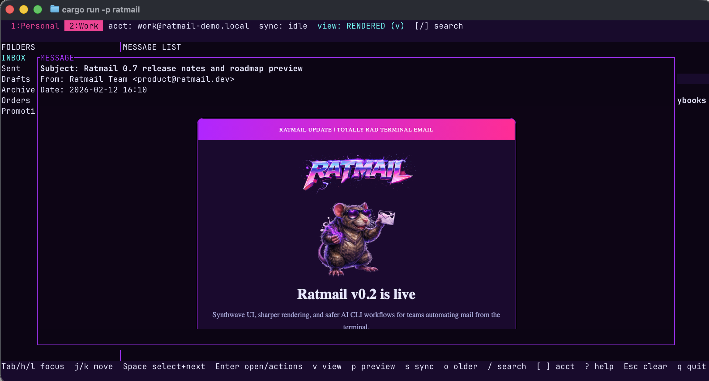

<p align="center">
  
</p>

Website: https://www.ratmail.dev/

Read the docs: https://www.ratmail.dev/docs

## Features

Terminal email client with dual-channel viewing (rendered HTML + high-quality text) and a JSON CLI.

- Dual-channel viewing: rendered HTML + high-quality text
- First-ever rendered email HTML within the terminal (Kitty/Sixel)
- Fast text view with link/attachment overlays
- Send text and styled HTML emails
- IMAP sync with local cache (SQLite)
- Multiple accounts with per-account databases and tab switching
- Proton Mail support via Bridge (IMAP/SMTP)
- Rapid targetted search dialog
- Spellchecker (Hunspell via `spellbook`, bundled en_US/en_GB)
- Optional Vim-style modal composing
- Coding-agent-compatible CLI with JSON output
- Commom preset and custom themes

## Screenshot

<p align="center">
  
</p>

## Getting started

1. Install from GitHub:

```bash
cargo install --git https://github.com/peter-fm/ratmail.git --locked
```

2. Run:

```bash
ratmail
```

3. On first run, Ratmail auto-creates:
`~/.config/ratmail/ratmail.toml` (or `$XDG_CONFIG_HOME/ratmail/ratmail.toml`)

4. Edit that file with your account details (see Configuration below).

## Run (dev)

```bash
cargo run -p ratmail
```

Or use the workspace alias:

```bash
cargo run-ratmail
```

## Install (from GitHub)

```bash
cargo install --git https://github.com/peter-fm/ratmail.git --locked
```

## Publish Binary Releases (GitHub)

You can publish prebuilt binaries to GitHub Releases with one command.

Prerequisites:
- `gh` authenticated (`gh auth login`)
- Rust target(s) installed (the script auto-installs missing targets)

Run (single host target):

```bash
scripts/release-gh.sh v0.2.0
```

Convenience wrappers:

```bash
scripts/macos-release.sh v0.2.0
scripts/linux-release.sh v0.2.0
```

Run (multiple targets from one machine, if toolchain supports it):

```bash
scripts/release-gh.sh v0.2.0 --targets aarch64-apple-darwin,x86_64-apple-darwin
```

If you build on multiple machines, run the same tag on each machine; assets upload to the same release:

```bash
scripts/release-gh.sh v0.2.0 --append
```

Order does not matter. The first run creates the release; later runs upload/update assets.

Outputs:
- `dist/v0.2.0/ratmail-0.2.0-<target>.tar.gz`
- `dist/v0.2.0/checksums.txt`

## Configuration

Ratmail looks for `ratmail.toml` in the current directory first, then in
`~/.config/ratmail/ratmail.toml` (or `$XDG_CONFIG_HOME/ratmail/ratmail.toml`).
Relative `db_path` values are stored under `~/.local/state/ratmail`
(or `$XDG_STATE_HOME/ratmail`).

Ratmail auto-creates `~/.config/ratmail/ratmail.toml` on first run. Fill in one or more accounts:

```toml
[[accounts]]
name = "Personal"
# Relative paths are stored under ~/.local/state/ratmail
db_path = "ratmail-personal.db"

[accounts.imap]
host = "imap.example.com"
port = 993
username = "user@example.com"
password = "app-password-or-imap-password"
skip_tls_verify = false
initial_sync_days = 90
fetch_chunk_size = 10

[accounts.smtp]
host = "smtp.example.com"
port = 587
username = "user@example.com"
password = "app-password-or-smtp-password"
from = "Your Name <user@example.com>"
skip_tls_verify = false

[render]
remote_images = true
render_scale = 1.5
tile_height_px_side = 1000
tile_height_px_focus = 60

[ui]
folder_width_cols = 25
theme = "default"
```

Notes:
- If `db_path` is omitted, it defaults to `ratmail-<account-name>.db`.
- `initial_sync_days` controls the first sync window; older mail can be loaded on demand.
- `fetch_chunk_size` is intentionally small for Proton Bridge reliability.
- Render width is auto-calculated from terminal geometry and `render_scale` at runtime.
- `ui.theme` controls the TUI palette (`default`, `ratmail`, `nord`, `gruvbox`, `solarized-dark`, `solarized-light`, `dracula`, `catppuccin-mocha`, `catppuccin-latte`, `custom`).
- `ui.compose_vim = true` enables Vim-style modal editing in the compose body.
- When `ui.theme = "custom"`, use `[ui.palette]` with hex colors (see `ratmail.toml.example`).

## Search (TUI)

The `/` search supports field filters:

- `from:alice` `subject:invoice` `to:bob`
- `date:2026-02-01` `since:2026-01-01` `before:2026-02-10`
- Attachments: `att:invoice` `file:report` `type:pdf` `mime:image/png`

Plain text without a `field:` prefix matches From/Subject/Preview.

## Multi-account tabs

- Tabs are shown in the top bar (e.g., `1:Personal 2:Work`).
- Switch accounts with `[` / `]` or by pressing a number key.

## Key bindings (core)

- `Tab` / `h` / `l`: focus panes
- `j` / `k`: move
- `Enter`: open message
- `v`: toggle rendered/text view
- `p`: toggle preview pane
- `s`: sync selected folder (check for new mail)
- `o`: load older messages (backfill)
- `?`: toggle help
- `q`: quit

## Spellcheck

Spellcheck uses Hunspell dictionaries via the `spellbook` crate.

Config options:
- `[spell]` `lang` selects the dictionary, e.g. `en_US` or `en_GB`.
- `[spell]` `dir` points to a directory containing `<lang>.aff` and `<lang>.dic`.

Lookup order (first match wins):
- `RATMAIL_SPELL_DIR/<lang>.aff` + `RATMAIL_SPELL_DIR/<lang>.dic`
- `assets/dict/<lang>.aff` + `assets/dict/<lang>.dic`
- `/usr/share/hunspell/<lang>.*`
- `/usr/share/myspell/<lang>.*`
- `/usr/share/myspell/dicts/<lang>.*`
- `/usr/local/share/hunspell/<lang>.*`
- `/opt/homebrew/share/hunspell/<lang>.*`
- `/Library/Spelling/<lang>.*`
- `/System/Library/Spelling/<lang>.*`

If no dictionary is found, spellcheck reports that it is unavailable.

Bundled dictionaries:
- `en_US` and `en_GB` are embedded in the binary (and also kept under `assets/dict` with their license files).

To install dictionaries:
- Arch: `pacman -S hunspell-en_US hunspell-en_GB`
- Debian/Ubuntu: `apt install hunspell-en-us hunspell-en-gb`
- Fedora: `dnf install hunspell-en-US hunspell-en-GB`
- macOS (Homebrew): `brew install hunspell` (dictionaries are **not** bundled). Download Hunspell dictionaries separately and place `.aff/.dic` files in `/usr/local/share/hunspell` (Intel) or `/opt/homebrew/share/hunspell` (Apple Silicon).
  Example (Spanish, `es_ES`):
  1. Download the LibreOffice dictionary extension for Spanish (`.oxt`).
  2. Extract `es_ES.aff` and `es_ES.dic` from the `.oxt`.
  3. Copy them into your Hunspell dir.
  4. Set in `ratmail.toml`: `[spell] lang = "es_ES"`

  Concrete steps:
  ```bash
  # Download the Spanish dictionary (.oxt) from LibreOffice Extensions
  curl -L -o es_ES.oxt "https://extensions.libreoffice.org/"

  # Extract and copy the hunspell files
  mkdir -p /tmp/ratmail-es && unzip -j es_ES.oxt "*/es_ES.aff" "*/es_ES.dic" -d /tmp/ratmail-es
  sudo mkdir -p /opt/homebrew/share/hunspell
  sudo cp /tmp/ratmail-es/es_ES.aff /opt/homebrew/share/hunspell/
  sudo cp /tmp/ratmail-es/es_ES.dic /opt/homebrew/share/hunspell/
  ```

  You can fetch LibreOffice dictionaries here (grab the `.oxt` for your language):
  `https://extensions.libreoffice.org/`
## CLI (JSON output)

Ratmail CLI returns JSON for scripting.
Use `ratmail setup` for an interactive account onboarding flow.

Set this in `ratmail.toml`:

```toml
[cli]
enabled = true
default_account = "Personal"
```

Examples:

```bash
ratmail setup
ratmail accounts list
ratmail folders list --account Personal
ratmail messages list --account Personal --folder INBOX --limit 20
ratmail messages list --account Personal --folder INBOX --query "from:alice subject:invoice type:pdf"
ratmail message get --account Personal --id 123
ratmail message get --account Personal --id 123 --body --fetch
ratmail sync --account Personal --folder INBOX --wait --timeout-secs 60
ratmail send --account Personal --to alice@example.com --subject "Hi" --body "Test" --wait
ratmail message attachment-save --account Personal --id 123 --index 0 --path /tmp/invoice.pdf --fetch
```

## Proton Mail Bridge (Linux/macOS)

Bridge uses a local IMAP/SMTP server with a self-signed cert. Use:

```toml
[accounts.imap]
host = "127.0.0.1"
port = 1143
skip_tls_verify = true
```

Common gotchas:
- Use the Bridge-provided username/password (not your Proton password).
- Match the Bridge IMAP/SMTP ports and security mode (STARTTLS on 1143 is typical).
- If sync stalls, reduce `fetch_chunk_size` (e.g., 5) and keep `initial_sync_days` small.

## Account setup (IMAP + SMTP)

Configure each account with both IMAP and SMTP blocks:

```toml
[[accounts]]
name = "Personal"
db_path = "ratmail-personal.db"

[accounts.imap]
host = "imap.example.com"
port = 993
username = "you@example.com"
password = "imap-password-or-app-password"
skip_tls_verify = false

[accounts.smtp]
host = "smtp.example.com"
port = 587
username = "you@example.com"
password = "smtp-password-or-app-password"
from = "Your Name <you@example.com>"
skip_tls_verify = false
```

Notes:
- `from` is the sender label shown to recipients: `Name <email@example.com>`.
- Many providers require app passwords (or provider-specific bridge passwords) instead of your normal login password.

### Gmail (example)

The easiest way to use Gmail IMAP/SMTP is with an **App Password** (requires 2-Step Verification).

1. Enable 2‑Step Verification on your Google account.
2. Create an App Password for “Mail”.
3. Edit `~/.config/ratmail/ratmail.toml` and set both IMAP and SMTP:

```toml
[[accounts]]
name = "Gmail"
db_path = "ratmail-gmail.db"

[accounts.imap]
host = "imap.gmail.com"
port = 993
username = "you@gmail.com"
password = "your-16-char-app-password"
skip_tls_verify = false

[accounts.smtp]
host = "smtp.gmail.com"
port = 587
username = "you@gmail.com"
password = "your-16-char-app-password"
from = "Your Name <you@gmail.com>"
skip_tls_verify = false
```

Notes:
- Gmail requires an app password for IMAP/SMTP when 2‑Step Verification is enabled.
- OAuth (browser login) is possible but not implemented yet.
